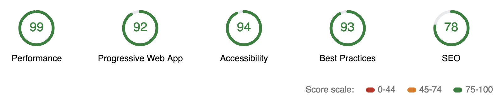

# Mobile Web Spacialists Nanodegree

My solution for the Google Mobile Web Specialist Nanodegree.

## Getting Started

Clone this repository and follow the instructions: https://github.com/munkacsitomi/mws-restaurant-stage-2

### Prerequisites

Install [node.js LTS Version: v8.11.3 ](https://nodejs.org/en/download/)

Install Gulp globally

```
npm install -g gulp
```

### Installing

Install node modules

```
npm install
```

### Run locally

Now we can start the project with Gulp

```
gulp
```

### Developer Notes

If you want to generate new images you need to setup some tools first.
1. Install ImageMagick `brew install imagemagick`
2. Install GraphicsMagick `brew install graphicsmagick`
3. Now you're able to generate new images: `gulp resize-images`

### Requirements for Stage 1

- [x] All content is responsive and displays on a range of display sizes.
- [x] Content should make use of available screen real estate and should display correctly at all screen sizes.
- [x] An image's associated title and text renders next to the image in all viewport sizes.
- [x] Images in the site are sized appropriate to the viewport and do not crowd or overlap other elements in the browser, regardless of viewport size.
- [x] On the main page, restaurants and images are displayed in all viewports. The detail page includes a map, hours and reviews in all viewports.
- [x] All content-related images include appropriate alternate text that clearly describes the content of the image.
- [x] Focus is appropriately managed allowing users to noticeably tab through each of the important elements of the page. Modal or interstitial windows appropriately lock focus.
- [x] Elements on the page use the appropriate semantic elements. For those elements in which a semantic element is not available, appropriate ARIA roles are defined.
- [x] When available in the browser, the site uses a service worker to cache responses to requests for site assets. Visited pages are rendered when there is no network access.

### Requirements for Stage 2

- [x] The client application should pull restaurant data from the development server, parse the JSON response, and use the information to render the appropriate sections of the application UI.
- [x] The client application works offline. JSON responses are cached using the IndexedDB API. Any data previously accessed while connected is reachable while offline.
- [x] The application maintains a responsive design on mobile, tablet and desktop viewports.
- [x] The application retains accessibility features from the Stage 1 project. Images have alternate text, the application uses appropriate focus management for navigation, and semantic elements and ARIA attributes are used correctly.
- [x] Lighthouse targets for each category exceed: Progressive Web App: >90, Performance: >70, Accessibility: >90.

